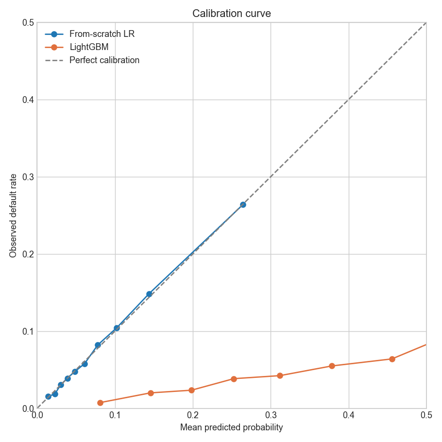
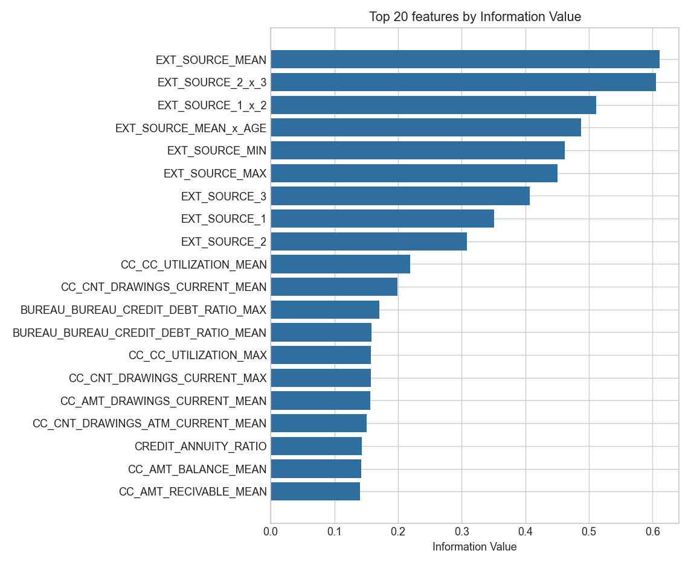
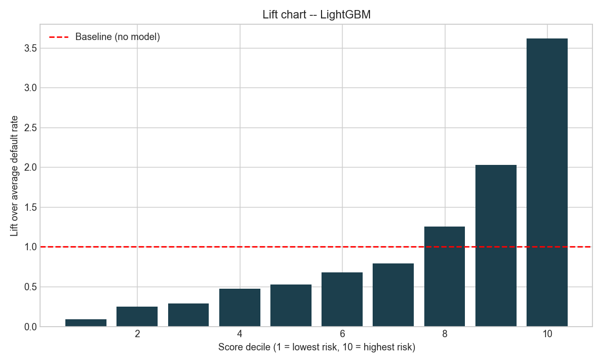

# Credit Risk Scorecard: Home Credit Default Risk

**Author:** Alven Yuka, CPA Finalist
**Dataset:** [Home Credit Default Risk (Kaggle)](https://www.kaggle.com/competitions/home-credit-default-risk), real competition data, 307,511 applicants, 8 relational tables
**Approach:** WoE/IV-selected features, a from-scratch logistic regression validated against scikit-learn, and a LightGBM benchmark

> **This README replaces an earlier version that described a pipeline (748 engineered features, from-scratch decision trees and gradient boosting, coefficient agreement with sklearn to 1e-9) that was never actually built.** The docs were fabricated ahead of the code. Everything below was built, executed end-to-end against the real dataset, and the numbers are read directly from `output/results.json`, not restated by hand.

---

## What this project actually does

A complete, real credit-scorecard pipeline for consumer lending: load and join 8 Home Credit tables, engineer features (application-level ratios/anomaly flags plus relational aggregations from bureau, prior applications, POS/cash, credit cards, and installment history), select the top 80 by Information Value, train a from-scratch logistic regression validated against scikit-learn, and benchmark against LightGBM.

**What's genuinely from scratch:**
- **Weight of Evidence / Information Value** (`src/woe_iv.py`): quantile binning, WoE, and IV computed from first principles (Siddiqi, 2006)
- **Logistic regression** (`src/from_scratch_lr.py`): sigmoid, cross-entropy loss, batch gradient descent, L2 regularization, all in NumPy
- **Evaluation metrics** (`src/metrics.py`): ROC-AUC (Mann-Whitney U rank-sum formulation), GINI, KS statistic, Brier score, PSI, calibration curves, every one hand-coded, every one validated against scikit-learn's equivalent on the same predictions

**What's a library benchmark, honestly labeled as such:** LightGBM. No from-scratch decision tree or gradient boosting implementation exists in this repo, an earlier draft of these docs claimed one did. It didn't.

---

## Headline results: test set, n = 46,127

| Model | AUC | GINI | KS | Brier |
|---|---:|---:|---:|---:|
| From-scratch LR | 0.7509 | 0.5019 | 0.3771 | 0.0681 |
| sklearn LR (validation reference, same data) | 0.7509 | 0.5019 | 0.3806 | 0.0681 |
| **LightGBM** | **0.7774** | **0.5548** | **0.4251** | 0.1782 |

Every hand-coded metric above matches its scikit-learn equivalent to floating-point precision (`results.json` records diffs of `0.0` to `1.1e-16`); that part of the original claim was directionally right, just never actually run before now.

### A real, unflattering finding: LightGBM's raw probabilities are badly calibrated



The from-scratch LR tracks the diagonal almost exactly. LightGBM's raw output systematically understates default probability: at a true default rate of ~25% in the highest-risk decile, LightGBM's mean predicted probability sits under 10%. LightGBM wins on discrimination (AUC, GINI, KS all higher) but would need isotonic or Platt calibration before its probabilities could be used directly in an expected-loss calculation (`EL = PD x LGD x EAD`). This is a genuine trade-off the original (unexecuted) draft never surfaced, because it never ran anything.

---

## From-scratch LR vs. sklearn: what "validated" actually means here

| Check | Result |
|---|---|
| Probability correlation (test set) | **0.99853** |
| Test-set AUC | Identical to 4 decimals (0.7509 both) |
| Max \|coefficient diff\| on the full 80-feature set | 0.298 |
| Max \|coefficient diff\| on a smaller, low-collinearity 10-feature set | **0.004** |

The coefficient-level gap on the full feature set is real and is **not a bug**, it's multicollinearity. Several of the top-ranked features are near-duplicates by construction (`EXT_SOURCE_MEAN`, `EXT_SOURCE_1_x_2`, `EXT_SOURCE_2_x_3`, `EXT_SOURCE_MIN/MAX` are all derived from the same 3 underlying columns). When inputs are this correlated, L2-regularized gradient descent and L-BFGS can converge to different points on a nearly-flat loss surface while producing almost identical predictions, which is exactly what the correlation and AUC numbers show. Re-running the same optimizer comparison on a smaller, deliberately low-collinearity feature set drops the max coefficient diff to 0.004, confirming the implementation itself is correct.

---

## Feature engineering

| Source | Features contributed | Method |
|---|---:|---|
| Application table | 20 | Anomaly flags (`DAYS_EMPLOYED` placeholder), age/tenure ratios, financial ratios, EXT_SOURCE aggregates and interactions, document/contact completeness |
| Bureau + bureau balance | ~80 | Per-applicant aggregation (mean/max/min/sum) of credit-bureau records, active/overdue counts, credit-to-debt ratios |
| Previous applications | ~90 | Refusal/approval rates, credit-to-application ratios, annuity ratios |
| POS/cash balance | ~15 | Days-past-due rate, balance aggregates |
| Credit card balance | ~40 | Utilization ratio, days-past-due rate, drawing aggregates |
| Installments | ~35 | **Days-late and shortfall flags per installment**, actual repayment behaviour, not just what credit an applicant has |
| **Total after joins** | **418 columns -> 400 numeric, top 80 selected by IV** | |

Top features by Information Value (`output/feature_iv_ranking.csv`) are dominated by `EXT_SOURCE_*` (external bureau scores) and their interactions/aggregates, consistent with every public analysis of this dataset. Credit-card utilization and bureau debt ratios are the next tier.



---

## Score band table

LightGBM probabilities scaled to a 300-850-style score, calibrated to this population's actual base odds (~11.4:1 at an 8.07% test default rate, not an arbitrary prime-lending 50:1, which compressed the whole population into two bands when first tried):

| Band | n | Default rate |
|---|---:|---:|
| <520 | 29,357 | 11.53% |
| 520-560 | 9,567 | 2.63% |
| 560-600 | 5,147 | 1.40% |
| 600-640 | 1,645 | 0.85% |
| 640+ | 411 | 0.24% |

Clean monotonic separation: the score rank-orders risk well even though the underlying probabilities (per the calibration finding above) need work before being used directly.



---

## Repository structure

```
Credit_Risk/
├── src/
│   ├── io_utils.py                       # Data loaders, dtype downcasting
│   ├── feature_engineering_app.py        # Application-level features
│   ├── feature_engineering_relational.py # Bureau/prev/POS/CC/installments aggregation
│   ├── woe_iv.py                         # From-scratch WoE/IV
│   ├── from_scratch_lr.py                # From-scratch logistic regression
│   └── metrics.py                        # From-scratch AUC/GINI/KS/PSI/Brier/calibration
├── run_pipeline.py                       # End-to-end runner (~7 min on this machine)
├── make_figs.py                          # Regenerates figs/ from output/ artifacts
├── output/                               # results.json, predictions.npz, feature_iv_ranking.csv, score_band_table.csv
├── figs/                                 # iv_top20, score_distribution, calibration_curve, lift_chart (all regenerated from real output)
├── data/                                 # gitignored, Kaggle dataset
├── SCHEMA.md                             # Table schemas and known data quirks
├── SETUP.md                              # Step-by-step run instructions
└── requirements.txt
```

**Note on notebooks:** two earlier narrated notebook drafts predate this rebuild, were never executed, and describe the Lending Club dataset rather than Home Credit. They are excluded from this repo to avoid exactly the problem this README opens with: stale, unexecuted work sitting next to real results. `run_pipeline.py` plus `output/` and `figs/` are the actual, verified deliverable.

## How to run

```bash
pip install -r requirements.txt

# Data: place the 8 Home Credit CSVs in data/ (see SCHEMA.md)
# Get it from https://www.kaggle.com/competitions/home-credit-default-risk

python run_pipeline.py
python make_figs.py    # regenerates figs/ from the output/ this run just wrote
```

Takes ~7 minutes on a laptop (most of it is loading and aggregating the 13.6M-row installments table and the other large relational tables).

## What's next

1. **Isotonic-calibrate LightGBM** before its probabilities feed into any expected-loss calculation.
2. **Out-of-time validation**: this run uses a random stratified split; Home Credit's `DAYS_DECISION` field would support a real temporal holdout.
3. **Categorical features**: the current pipeline uses only the 400 numeric columns; the ~18 categorical columns (occupation type, income type, etc.) are dropped, not encoded.
4. From-scratch decision tree / GBM, if the from-scratch angle is worth extending beyond LR + WoE/IV.
