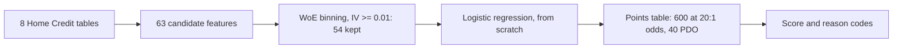

# Credit Risk Scorecard

A points-based credit scorecard for 307,511 Home Credit loan applicants, built on Weight of Evidence and a
logistic regression written from first principles. It ranks borrowers at **AUC 0.761** and **KS 0.393** on
61,503 held-out applicants, and every decision comes with its reasons.

[](LICENSE)
[](#getting-started)
[](https://github.com/alvenyuka/Credit-Risk-Scorecard/actions/workflows/ci.yml)


## Overview

Retail lenders need a model they can explain as well as trust. Fair-lending rules require a specific reason
for every decline, and model-risk teams expect to review the direction of each variable before a model goes
live. A scorecard meets both: each applicant characteristic adds or removes a fixed number of points.

This project builds one on Home Credit's public data (applications, credit-bureau records and previous loans
across eight tables). Weight of Evidence binning, the logistic regression solver and the AUC, KS, GINI and PSI
metrics are implemented directly and tested against scikit-learn and scipy. Sex and marital status are excluded
as prohibited bases under the US Equal Credit Opportunity Act and Regulation B.

## Results

| Metric (61,503 held-out applicants) | Value |
|---|---:|
| AUC | **0.761** |
| KS | **0.393** |
| GINI | 0.522 |
| Default rate, lowest vs highest score decile | 27.0% vs 1.2% |
| Mean score, repaid vs defaulted (scale 300 to 648) | 455 vs 400 |

- Removing the prohibited bases cost 0.001 AUC (0.762 to 0.761), so the lawful model gives up almost nothing.
- The hand-written solver matches scikit-learn: predictions correlate at 0.999997 and coefficients agree to
  within 0.0034.
- Decline reasons read the way a credit officer would give them, for example "employment record flagged as
  anomalous: -18.4 points; share of previous applications refused: -10.3 points".

## Approach


```mermaid
flowchart LR
    A[8 Home Credit tables] --> B[63 candidate features]
    B --> C[WoE binning, IV >= 0.01: 54 kept]
    C --> D[Logistic regression, from scratch]
    D --> E[Points table: 600 at 20:1 odds, 40 PDO]
    E --> F[Score and reason codes]
```

1. **Features.** Application ratios plus aggregates of bureau history, previous applications, instalments and
   card balances.
2. **Weight of Evidence.** Numeric features in deciles, categoricals by level, with smoothing for sparse bins;
   features below an information value of 0.01 are dropped.
3. **Model.** Class-balanced logistic regression fitted by gradient descent on the WoE values.
4. **Scaling.** Coefficients become points with 600 at 20:1 good-to-bad odds and 40 points to double the odds;
   the largest point losses become the reason codes.
5. **Validation.** A random 80/20 holdout. Every headline number is written by the pipeline to
   [`outputs/results.json`](outputs/results.json), together with the commit and package versions.

## Repository structure

```
src/                    features, WoE/IV, logistic regression, metrics, scorecard, figures
tests/                  30 tests: statistics vs scikit-learn and scipy, binning, fair-lending exclusions
outputs/results.json    every headline metric, written by the pipeline
figures/                charts drawn from the same model
docs/METHODOLOGY.md     full method and results
```

## Getting started

```bash
pip install -r requirements.txt
python -m pytest              # 30 tests, no data needed
# put the 8 Home Credit Default Risk CSVs from Kaggle in data/
python src/week8_full.py      # fit, score and write outputs/results.json (about 7 minutes)
python src/make_figures.py    # redraw figures/
```

## Notes

- Scores rank risk well, but the probabilities come from a class-balanced fit and are not calibrated to the 8%
  base default rate.
- The dataset carries no application dates, so validation is a random holdout rather than out-of-time.

## Documentation

The walkthrough notebook is [`Credit_Risk_Scorecard.ipynb`](Credit_Risk_Scorecard.ipynb); the full method, every
result and the test suite are in [`docs/METHODOLOGY.md`](docs/METHODOLOGY.md).

## License

MIT. See [`LICENSE`](LICENSE). Data: [Home Credit Default Risk](https://www.kaggle.com/competitions/home-credit-default-risk) (Kaggle).

Alven Yuka · [LinkedIn](https://www.linkedin.com/in/alven-yuka-610b78174/) · [Email](mailto:alvenyuka2@gmail.com)
