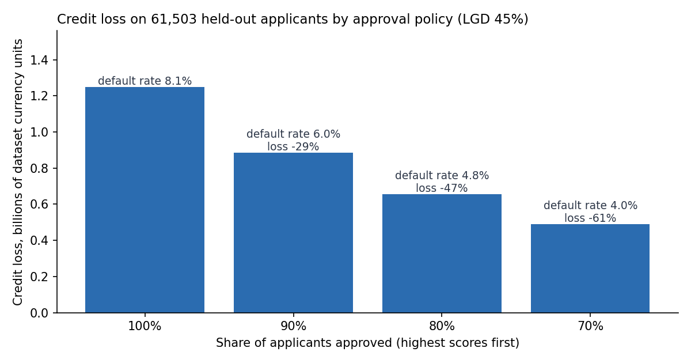
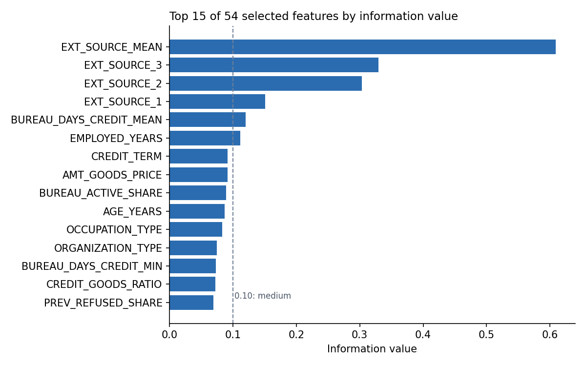

# Credit Risk Scorecard

A credit scorecard that tells a lender which loan applicants are likely to default, and gives a specific reason
for every decline. Tested on 61,503 past applicants it had not seen, approving only the top 80% by score would
have **cut credit losses by 47%**. Built on 307,511 Home Credit applications with Weight of Evidence and a
logistic regression written from first principles (**AUC 0.754**), with every characteristic's direction checked,
every bin's points moving in one direction, and 600 points calibrated to mean 20:1 good-to-bad odds.

[](LICENSE)
[](#reproduce)
[](https://github.com/alvenyuka/Credit-Risk-Scorecard/actions/workflows/ci.yml)


## Model summary

| | |
|---|---|
| Decision supported | Approve or decline a consumer loan application, with the reasons for a decline |
| Population | 307,511 Home Credit applicants with a known outcome, 8.1% of whom defaulted |
| Data | The application plus seven linked tables: credit-bureau records, previous applications, instalments, card balances |
| Model | Logistic regression on Weight of Evidence, 32 characteristics selected from 62, coarse-classed so every bin's points move one way |
| Score scale | 600 points = 20:1 good-to-bad odds; every 40 points doubles the odds |
| Holdout | 61,503 applicants (random 20%, stratified), never used in fitting |
| Discrimination | AUC 0.754, KS 0.381 |
| Recommended policy | Approve the top 80% (score 541 or above): credit losses fall 47% |

## The approval policy it supports

On the holdout, approve only the highest-scoring share of applicants. Credit loss is the credit amount of each
approved loan that defaulted, times a loss given default of 45% (the Basel foundation-IRB value for senior
unsecured lending). Home Credit does not state its currency, so amounts are in the dataset's units.

| Policy | Approved | Default rate | Credit loss | Loss avoided | Good borrowers declined |
|---|---:|---:|---:|---:|---:|
| Approve everyone | 61,503 | 8.1% | 1.25 bn | n/a | 0 |
| Approve top 90% (score ≥ 514) | 55,353 | 6.0% | 0.89 bn | 29% | 8.0% |
| Approve top 80% (score ≥ 541) | 49,202 | 4.9% | 0.66 bn | **47%** | 17.2% |
| Approve top 70% (score ≥ 560) | 43,052 | 4.1% | 0.50 bn | 60% | 27.0% |



At a 90% approval rate the scorecard removes 29% of credit losses while turning away about one good borrower
in twelve. Where to set the cut-off depends on the margin earned on a good loan against the loss on a bad one,
which this table lets a committee price directly.

## How a decline is explained

Every characteristic gives a fixed number of points for each of its bins, so a decline can be explained by the
characteristics on which the applicant lost the most points against the best possible answer. A characteristic
on which the applicant already scored the maximum is never given as a reason.

For a defaulted applicant in the holdout who scored 530, below the 541 cut-off of the 80% policy: *external
bureau score 3, 58.1 points below the best band; education level, 43.1 points below the best; average external
bureau score, 27.5 points below the best.* The full points table for every bin is in
[`outputs/scorecard_points.json`](outputs/scorecard_points.json).

## Performance on the holdout

| Metric (61,503 held-out applicants) | Value |
|---|---:|
| AUC (95% bootstrap interval) | **0.754** (0.747 to 0.761) |
| KS | **0.381** |
| GINI | 0.508 |
| Default rate, lowest vs highest score decile | 26.4% vs 1.3% |
| Mean score, repaid vs defaulted (observed range 389 to 787) | 594 vs 542 |
| Good-to-bad odds at 600: scorecard vs observed (scores 580 to 620) | 20.0 vs 20.2 |
| Largest gap, predicted vs observed default rate (by decile) | 0.4 points |
| Score stability, training vs holdout (PSI) | 0.0002 |


Calibration holds: after the intercept is corrected to the real default rate, predicted and observed default
rates agree within 0.4 percentage points in every decile, so the score can be read as a probability of default.

## How the scorecard was built


```mermaid
flowchart LR
    A[8 Home Credit tables] --> B[62 candidate characteristics]
    B --> C[IV >= 0.01: 53]
    C --> D[Correlation gate: 47]
    D --> E[Sign gate: 32 kept]
    E --> F[Logistic regression, from scratch]
    F --> G[Points: 600 at 20:1 odds, 40 PDO]
    G --> H[Score, reason codes, approval cut-off]
```

1. **Data and sample.** Application ratios (credit to income, annuity to income, credit term) and applicant-level
   aggregates of bureau history, previous applications, instalments and card balances. `DAYS_EMPLOYED` carries a
   placeholder of 365,243 days for pensioners and the unemployed; it is set to missing, so the scorecard reads
   that group through the `Missing` bin of years employed.
2. **Characteristic analysis.** Numeric characteristics start from decile bins and are then coarse-classed: neighbouring
   bins are merged until the default rate moves in one direction, with a separate bin for zero in mostly-zero columns.
   Categoricals are binned by level. Each bin is replaced by its Weight of Evidence, with smoothing for sparse bins.
3. **Variable selection.** Three gates, each with a reason a reviewer can check: information value below 0.01 is
   dropped; of any pair of WoE columns correlated above 0.9 the higher-IV one is kept; and any characteristic
   whose coefficient takes the wrong sign once the others are in the model is removed and the model refitted.
4. **Model fit.** A class-balanced logistic regression fitted by gradient descent on standardised WoE values.
   WoE, IV, the solver and the AUC, KS, GINI and PSI metrics are implemented in `src/` and tested against
   scikit-learn and scipy; predictions correlate with scikit-learn's fit at 0.999999.
5. **Scaling.** The intercept is shifted from the 50/50 prior of the balanced fit back to the training default
   rate, then coefficients become points with 600 at 20:1 odds and 40 points to double the odds.

### Two decisions tested before they were made

- **Coarse classing replaced ten equal bins.** With equal bins, only 11 of 32 numeric characteristics had points
  that moved in one direction across their bins; a safer bin could earn fewer points than a riskier neighbour.
  `src/challengers.py` built both versions on the development applicants only and compared them on a validation
  slice, under a rule fixed beforehand: adopt coarse classing if it costs no more than 0.005 AUC. It cost 0.003,
  so it was adopted, and now 27 of 27 numeric characteristics are monotonic. On the holdout the published AUC
  moved from 0.759 to 0.754, while calibration tightened and the loss avoided at 80% approval rose from 46% to
  47%. Every figure on this page is the coarse-classed scorecard's.
- **What readability costs.** A LightGBM model on the same 62 candidates reaches a holdout AUC of 0.781, 0.027
  above the scorecard. That is the price of a model whose every point has a reason; it is recorded in
  [`outputs/challengers.json`](outputs/challengers.json), and LightGBM is a benchmark only.

The notebook [`Credit_Risk_Scorecard.ipynb`](Credit_Risk_Scorecard.ipynb) builds the scorecard step by step in
four parts: what the data can support (the application table loaded with `pd.read_csv`, checked and explored,
the six history tables rolled up to one row per applicant, the holdout kept back), building the scorecard (WoE
and IV by hand and then on every candidate, the three gates, the from-scratch fit, points), validation and use
(ROC, KS, calibration, PSI, fair lending, the approval policy, a decline explained), and limits and record. It
asserts that its step-by-step build equals the tested pipeline and that every figure equals `outputs/results.json`.

## What drives the score



- **External bureau scores dominate.** The three `EXT_SOURCE` scores and their average carry far more
  information than any field on the application form; the average (IV 0.61) was checked for leakage and kept,
  because all three scores exist when the application is made.
- **Behavioural history adds real signal.** Bureau credit age, the share of active bureau credit and the share
  of previous applications refused all rank among the top 15 characteristics.
- **Fifteen characteristics changed direction once the others were in the model.** Age, the number of bureau
  records and previous applications, and the credit amount among them: each looked protective or risky on its
  own but took the opposite sign alongside correlated characteristics. Left in, they would have awarded points
  to the riskier bins. The sign gate removes them; every remaining coefficient is negative.
- **A small, independent set is enough.** 32 characteristics reach AUC 0.754, against 0.751 for an earlier
  400-candidate version of this pipeline (its README at commit `a8708a0~1`).

## Fair-lending controls

- **No prohibited basis.** Sex (`CODE_GENDER`) and marital status (`NAME_FAMILY_STATUS`) are prohibited bases
  under the US Equal Credit Opportunity Act and Regulation B. They are excluded from every feature list, and a
  test fails if either is reintroduced.
- **Excluding them costs little.** Adding both back to the final characteristics would move AUC from 0.7540 to
  0.7553 (same split, recorded in `outputs/results.json`).
- **No negative points for age 62 or over.** Kept with its reversed sign, age would have given the oldest
  applicants negative points, which Regulation B does not allow. Age is removed by the sign gate, and an
  acceptance check runs on every build.
- **Pensioners are not penalised.** The placeholder for pensioners is read through one encoding only, so the
  group receives positive points, in line with its lower default rate.

## Validation limits

- **Random, not out-of-time, validation.** The dataset carries no application dates, so a forward time split
  cannot be built, and calibration on a later population is untested.
- **Loss uses one LGD and ignores revenue.** The policy table applies a single 45% LGD and does not model the
  interest earned on good loans, so it shows the loss side of the cut-off decision only.
- **PD only.** A full IFRS 9 provision also needs loss-given-default and exposure-at-default models.

## Reproduce

```bash
pip install -r requirements.txt    # pinned to the versions in outputs/results.json
python -m pytest                   # 69 tests, no data needed
# put the 8 Home Credit Default Risk CSVs from Kaggle in data/
python src/run_pipeline.py         # one fit: score, check and write outputs/ (15 to 20 minutes the first time)
python src/make_figures.py         # score distribution and default rate by band (seconds)
python src/business_impact.py      # approval-policy table, lending-policy and IV charts (seconds)
python src/challengers.py          # coarse classing and LightGBM against the decile scorecard (about 15 minutes)
```

```
src/                          features, WoE/IV, logistic regression, metrics, scorecard and checks,
                              run_pipeline.py (the release run), figures, business_impact.py
tests/                        69 tests: statistics vs scikit-learn and scipy, binning and coarse classing,
                              scorecard arithmetic and prior correction, screening gates, fair-lending checks,
                              policy arithmetic
outputs/results.json          every headline metric and check, written by the pipeline
outputs/business_impact.json  approval-policy table with its assumptions
outputs/scorecard_points.json the points for every bin of every kept characteristic
outputs/challengers.json      the champion-challenger comparison behind coarse classing, and the LightGBM benchmark
figures/                      charts drawn from the same model
figs/                         charts drawn by the notebook (plus four from an earlier pipeline, kept for its demo page)
output/                       demo data from that earlier pipeline
outputs/notebook_run.json     date, runtime, memory and library versions of the stored notebook run
Credit_Risk_Scorecard.ipynb   the analysis in four parts, executed end to end; its charts are in figs/
build_notebook.py             generates the notebook (edit this, not the .ipynb)
docs/METHODOLOGY.md           full method, results and test descriptions
```

The full method, every result and the test suite are described in [`docs/METHODOLOGY.md`](docs/METHODOLOGY.md).

## License

MIT. See [`LICENSE`](LICENSE). Data: [Home Credit Default Risk](https://www.kaggle.com/competitions/home-credit-default-risk) (Kaggle).

Alven Yuka · [LinkedIn](https://www.linkedin.com/in/alven-yuka-610b78174/) · [Email](mailto:alvenyuka2@gmail.com)
