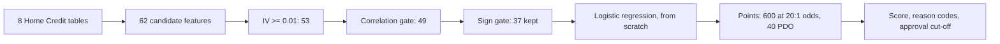

# Credit Risk Scorecard

A credit scorecard that tells a lender which loan applicants are likely to default, and gives a specific reason
for every decline. Tested on 61,503 past applicants it had not seen, approving only the top 80% by score would
have **cut credit losses by 46%**. Built on 307,511 Home Credit applications with Weight of Evidence and a
logistic regression written from first principles (**AUC 0.759**), with every characteristic's direction checked
and 600 points calibrated to mean 20:1 good-to-bad odds.

[](LICENSE)
[](#how-to-run)
[](https://github.com/alvenyuka/Credit-Risk-Scorecard/actions/workflows/ci.yml)


## Contents

1. [Business problem](#business-problem)
2. [Dataset](#dataset)
3. [Methodology](#methodology)
4. [Results](#results)
5. [Business impact](#business-impact)
6. [Key insights](#key-insights)
7. [Limitations](#limitations)
8. [Repository structure](#repository-structure)
9. [How to run](#how-to-run)
10. [Documentation](#documentation)
11. [License](#license)

## Business problem

A consumer lender approving loans to applicants with thin or no credit history has to answer two questions
at once: who is likely to repay, and why was a declined applicant declined. Fair-lending rules require a
specific reason for every adverse decision, and model-risk teams expect to review the direction of each
variable before a model goes live.

A scorecard answers both. Each applicant characteristic adds or removes a fixed number of points, the total
sets the decision, and the points an applicant lost against the best possible answer are the reasons given.
The questions for this project are how well such a scorecard separates good and bad borrowers on real data,
and what it is worth to a lender as an approval policy.

## Dataset

[Home Credit Default Risk](https://www.kaggle.com/competitions/home-credit-default-risk) (Kaggle): 307,511
applications with a repaid/defaulted outcome, and seven linked tables of credit-bureau records, previous
applications, instalment payments and card balances.

| Property | Value |
|---|---:|
| Applicants with an outcome | 307,511 |
| Default rate | 8.1% |
| Linked tables | 8 |
| Holdout (random 20%, stratified) | 61,503 applicants |
| Candidate features | 62 |
| Features kept after screening | 37 |

Sex (`CODE_GENDER`) and marital status (`NAME_FAMILY_STATUS`) are prohibited bases under the US Equal
Credit Opportunity Act and Regulation B, so they are excluded from every feature list, and a test fails if
either is reintroduced.

## Methodology


```mermaid
flowchart LR
    A[8 Home Credit tables] --> B[62 candidate features]
    B --> C[IV >= 0.01: 53]
    C --> D[Correlation gate: 49]
    D --> E[Sign gate: 37 kept]
    E --> F[Logistic regression, from scratch]
    F --> G[Points: 600 at 20:1 odds, 40 PDO]
    G --> H[Score, reason codes, approval cut-off]
```

1. **Feature engineering.** Application ratios (credit to income, annuity to income, credit term) and
   applicant-level aggregates of bureau history, previous applications, instalments and card balances.
   `DAYS_EMPLOYED` carries a placeholder of 365,243 days for pensioners and the unemployed; it is set to
   missing, so the scorecard reads that group through the `Missing` bin of years employed.
2. **Weight of Evidence and screening.** Numeric features are binned in deciles and categoricals by level,
   with smoothing for sparse bins. Features with an information value below 0.01 are dropped; of any pair of
   WoE columns correlated above 0.9 the higher-IV one is kept; and any feature whose coefficient comes out
   with the wrong sign (its effect reversed once the others are in the model) is removed and the model
   refitted, until every characteristic points in the direction of its own data.
3. **Model.** A class-balanced logistic regression fitted by gradient descent on standardised WoE values.
   WoE, IV, the solver and the AUC, KS, GINI and PSI metrics are implemented in `src/` and tested against
   scikit-learn and scipy.
4. **Scaling.** The intercept is shifted from the 50/50 prior of the balanced fit back to the training
   default rate, then coefficients become points with 600 at 20:1 good-to-bad odds and 40 points to double
   the odds. A reason code is the gap between an applicant's points on a characteristic and the most that
   characteristic can give.
5. **Business evaluation.** On the holdout, approve only the highest-scoring share of applicants and measure
   the default rate, the credit loss and the good borrowers turned away (`src/business_impact.py`).

Every metric is written by the pipeline to [`outputs/results.json`](outputs/results.json), every money figure
to [`outputs/business_impact.json`](outputs/business_impact.json) and the full points table to
[`outputs/scorecard_points.json`](outputs/scorecard_points.json), with the commit and package versions.

## Results

| Metric (61,503 held-out applicants) | Value |
|---|---:|
| AUC (95% bootstrap interval) | **0.759** (0.752 to 0.766) |
| KS | **0.388** |
| GINI | 0.517 |
| Default rate, lowest vs highest score decile | 26.9% vs 1.3% |
| Mean score, repaid vs defaulted (observed range 401 to 791) | 595 vs 541 |
| Good-to-bad odds at 600: scorecard vs observed (scores 580 to 620) | 20.0 vs 20.5 |
| Largest gap, predicted vs observed default rate (by decile) | 0.7 points |
| Score stability, training vs holdout (PSI) | 0.0002 |
| Prediction correlation with scikit-learn's fit | 0.999999 |


A declined applicant receives reasons in the terms a credit officer would use. For a defaulted applicant in
the holdout who scored 533, below the 541 cut-off of the 80% policy: *external bureau score 3, 57.8 points
below the best band; education level, 41.0 points below the best; average external bureau score, 27.5 points
below the best.*

## Business impact

Approving only the highest-scoring applicants, on the same 61,503-applicant holdout. Credit loss is the credit
amount of each approved loan that defaulted, times a loss given default of 45% (the Basel foundation-IRB value
for senior unsecured lending). Home Credit does not state its currency, so amounts are in the dataset's units.

| Policy | Approved | Default rate | Credit loss | Loss avoided | Good borrowers declined |
|---|---:|---:|---:|---:|---:|
| Approve everyone | 61,503 | 8.1% | 1.25 bn | n/a | 0 |
| Approve top 90% (score ≥ 514) | 55,353 | 6.0% | 0.89 bn | 29% | 8.0% |
| Approve top 80% (score ≥ 541) | 49,202 | 4.9% | 0.67 bn | **46%** | 17.2% |
| Approve top 70% (score ≥ 560) | 43,052 | 4.0% | 0.50 bn | 60% | 26.9% |


At a 90% approval rate the scorecard removes 29% of credit losses while turning away about one good borrower
in twelve. Where to set the cut-off depends on the margin earned on a good loan against the loss on a bad one,
which this table lets a credit committee price directly.

## Key insights

- **External bureau scores dominate.** The three `EXT_SOURCE` scores and their average carry far more
  information than any field on the application form; the average (IV 0.61) was checked for leakage and kept,
  because all three scores exist when the application is made.
- **Twelve features changed direction once the others were in the model.** Age, the number of bureau records
  and previous applications, and the credit amount among them: each looked protective or risky on its own
  but took the opposite sign alongside correlated features. Left in, they would have awarded points to the
  riskier bins, and age would have given the oldest applicants negative points, which Regulation B does not
  allow for applicants aged 62 or over. The sign gate removes them; every remaining coefficient is negative.
- **Behavioural history adds real signal.** Bureau credit age, the share of active bureau credit and the share
  of previous applications refused all rank among the top 15 features.
- **Excluding prohibited bases costs little.** Adding sex and marital status back to the final feature set
  would move AUC from 0.7585 to 0.7598 (same split, recorded in `outputs/results.json`).
- **A small, independent feature set is enough.** 37 features reach AUC 0.759, against 0.751 for an earlier
  400-candidate version of this pipeline (its README at commit `a8708a0~1`).


## Limitations

- **Calibration is checked on a random holdout only.** After the prior correction, predicted default rates
  match observed rates within 0.7 percentage points in every decile of the holdout, so the score reads as a
  probability of default; how it holds on a later population is untested.
- **Random, not out-of-time, validation.** The dataset carries no application dates, so a forward time split
  cannot be built.
- **Loss uses one LGD and ignores revenue.** The business-impact table applies a single 45% LGD and does not
  model the interest earned on good loans, so it shows the loss side of the cut-off decision only.
- **PD only.** A full IFRS 9 provision also needs loss-given-default and exposure-at-default models.

## Repository structure

```
src/                         features, WoE/IV, logistic regression, metrics, scorecard and checks,
                             run_pipeline.py (the release run), figures, business_impact.py
tests/                       65 tests: statistics vs scikit-learn and scipy, binning, scorecard
                             arithmetic and prior correction, screening gates, fair-lending checks,
                             approval-policy arithmetic
outputs/results.json         every headline metric and check, written by the pipeline
outputs/business_impact.json approval-policy table with its assumptions
outputs/scorecard_points.json the points for every bin of every kept feature
figures/                     charts drawn from the same model
figs/, output/               charts and demo data from an earlier pipeline, kept for its demo page
Credit_Risk_Scorecard.ipynb  walkthrough notebook in scorecard-development order, executed end to end
build_notebook.py            generates the notebook (edit this, not the .ipynb)
docs/METHODOLOGY.md          full method, results and test descriptions
```

## How to run

```bash
pip install -r requirements.txt    # pinned to the versions in outputs/results.json
python -m pytest                   # 65 tests, no data needed
# put the 8 Home Credit Default Risk CSVs from Kaggle in data/
python src/run_pipeline.py         # one fit: score, check and write outputs/ (15 to 20 minutes the first time)
python src/make_figures.py         # score distribution and default rate by band (seconds)
python src/business_impact.py      # approval-policy table, lending-policy and IV charts (seconds)
```

## Documentation

The walkthrough notebook is [`Credit_Risk_Scorecard.ipynb`](Credit_Risk_Scorecard.ipynb). It follows the order a
scorecard is developed and reviewed: data and sample design, benchmarks, characteristic analysis (Weight of Evidence
computed by hand for one feature), variable selection (the three gates applied one at a time), model fit, scaling to
points, validation, and lending strategy with reason codes. Checks after the key steps stop it if a step goes wrong,
and it asserts that its step-by-step build equals the tested pipeline. The full method, every result and the test
suite are described in [`docs/METHODOLOGY.md`](docs/METHODOLOGY.md).

## License

MIT. See [`LICENSE`](LICENSE). Data: [Home Credit Default Risk](https://www.kaggle.com/competitions/home-credit-default-risk) (Kaggle).

Alven Yuka · [LinkedIn](https://www.linkedin.com/in/alven-yuka-610b78174/) · [Email](mailto:alvenyuka2@gmail.com)
