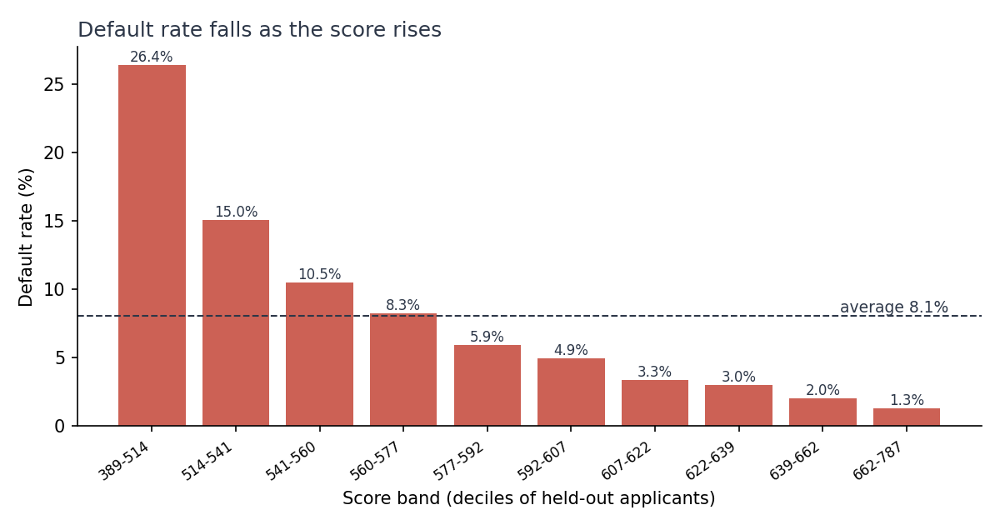
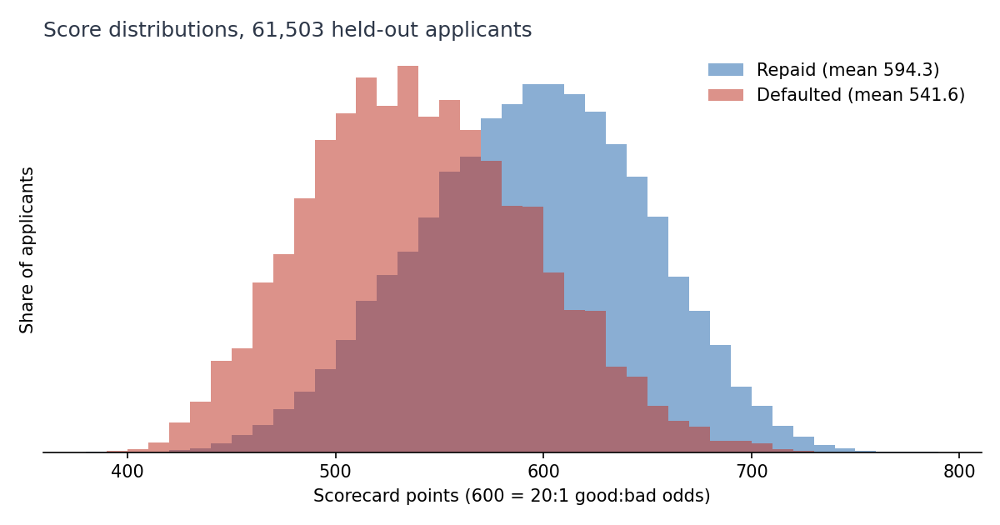

# Credit Risk Scorecard: full methodology

> The detailed write-up behind the short [README](../README.md): method, every result, tests, and known limitations.

From-scratch WoE/IV and logistic regression on Home Credit's 307,511 real loan applicants, checked against scikit-learn and scipy at every step, with a points-based scorecard that gives a declined applicant a specific reason.

[](../LICENSE)
[](#tech-stack)
[](#tech-stack)
[](#results)
[](https://github.com/alvenyuka/Credit-Risk-Scorecard/actions/workflows/ci.yml)

A credit scorecard for Home Credit's loan applicants, built from Weight of
Evidence, a from-scratch logistic regression, and a points-based scorecard
a loan officer can read.

Start with [`Credit_Risk_Scorecard.ipynb`](../Credit_Risk_Scorecard.ipynb). It runs
the full 307,511-applicant dataset end to end in the order a scorecard is
developed and reviewed (data and sample design, benchmarks, characteristic
analysis, variable selection, model fit, scaling, validation, strategy), one
small step at a time, with "Check" assertions after the steps that matter. It computes Weight of Evidence by hand, applies
the three feature gates one at a time, converts the model to points, and asserts
that this step-by-step build equals the tested pipeline. Its last cell checks that
every figure it shows equals `outputs/results.json`.

## Question

A credit model that declines someone often has to say why. Under the US Equal
Credit Opportunity Act that reason has to be specific, and the EU AI Act treats
credit scoring as high risk, which puts the same pressure on documentation and
explainability. A gradient-boosted model would likely score higher than what is
here and could not answer that question directly.

So this is a scorecard: Weight of Evidence bins, a logistic regression over them,
and a points table where every bin contributes a fixed number of points. A
declined applicant's reasons come back as "58.1 points below the best band on an
external bureau score" rather than a probability with no account of itself. The
direction of every characteristic is enforced, and each bin's WoE and points can
be read off a table before the model is used.

The second reason is that the statistics are written out rather than imported.
Weight of Evidence, Information Value, the logistic regression solver, and
AUC, GINI, KS and PSI are all built here and then checked against scikit-learn
and scipy; the KS check caught a real defect under tied scores (see Tests).

## Project Structure

```
Credit_Risk_Scorecard.ipynb   the notebook, run end to end
build_notebook.py             generates the notebook, edit this not the .ipynb
src/
  feature_lists.py            every feature list and screening threshold, imported everywhere
  io_raw.py                   loads the application table (HOME_CREDIT_DATA_DIR overrides data/)
  baseline_features.py        application-level features
  baseline_model.py           the impute-scale-one-hot baseline
  woe_iv.py                   Weight of Evidence / Information Value, bin order, monotonicity report
  metrics_scratch.py          AUC, GINI, KS, PSI, deciles, calibration, bootstrap CI
  from_scratch_lr.py          logistic regression by gradient descent, with convergence record
  relational_features.py      bureau / previous application / payment history, fingerprinted cache
  woe_baseline.py             WoE baseline on the application table, primitives checked on real data
  fit_model.py                full feature set, IV / correlation / sign gates, model fit
  scorecard.py                points scorecard, prior correction, reason codes, acceptance checks
  run_pipeline.py             one fit, scorecard, checks and holdout metrics; writes outputs/
  make_figures.py             score distribution and default rate by band
  business_impact.py          approval-policy table, lending-policy and IV charts
  results_io.py               writes outputs/results.json; the README quotes it
tests/
  test_metrics_scratch.py     AUC/GINI/KS/PSI vs sklearn and scipy
  test_from_scratch_lr.py     the solver vs sklearn, incl. class_weight and convergence
  test_woe_iv.py              WoE/IV binning, smoothing, bin order and known binning limits
  test_scorecard.py           de-standardisation, scoring, prior correction, reason codes, sign check
  test_feature_screening.py   feature engineering, correlation gate, sign gate
  test_fair_lending.py        prohibited bases absent from every list; Regulation B age check
  test_business_impact.py     approval-policy arithmetic, tied scores, strict JSON
  test_relational_cache.py    the cache fingerprint
conftest.py                   puts src/ on sys.path so tests import it the way the scripts do
pytest.ini
requirements.txt              pinned to the versions in outputs/results.json
requirements-test.txt         the subset CI installs, same pins
outputs/
  results.json                every headline number, written by the code
  business_impact.json        approval-policy table with its assumptions
  scorecard_points.json       the points table: every bin of every kept feature
figures/                      charts drawn from the current model
output/                       demo_applicants.json, from an earlier pipeline (kept for the demo page)
figs/                         four charts from an earlier pipeline (kept for the demo page)
.github/workflows/ci.yml      runs the tests on every push
```

## Quick Start

1. Download the 8 CSVs from Home Credit Default Risk on Kaggle (see "Dataset" below) and put them in `data/`.
2. `pip install -r requirements.txt` (pinned to the versions recorded in `outputs/results.json`).
3. `python src/run_pipeline.py`, then `python src/make_figures.py` and `python src/business_impact.py`.
4. `python build_notebook.py`, then execute the generated notebook end to end (full commands under "Running it" below). Note that `build_notebook.py` overwrites the committed notebook with a fresh, output-free copy, so the stored outputs are gone until you execute it.

## Features

- **Weight of Evidence / Information Value, logistic regression, and scoring metrics (AUC, GINI, KS, PSI) built from scratch**, not imported. The metrics and the solver were checked against scikit-learn and scipy before being trusted. WoE/IV has no library equivalent to check against, so it is covered by its own test suite instead (see "Tests").
- **A points-based scorecard** whose 600-point anchor really means 20:1 good-to-bad odds (prior-corrected intercept), with reason codes by the points-below-maximum method.
- **Acceptance checks on every run**: every coefficient negative on WoE inputs, no negative points for applicants aged 62 or over, no prohibited basis in the scorecard, and the notebook asserted equal to `outputs/results.json`.
- **Application, bureau, and previous-application history** combined into a single feature set (62 candidate features, of which 8 are WoE-encoded as categorical; sex and marital status are excluded as prohibited bases).
- **A live case-study page** ([credit-risk-alven.vercel.app](https://credit-risk-alven.vercel.app)) showing 20 held-out applicants scored by an earlier pipeline. It reads `output/demo_applicants.json`, which belongs to that earlier pipeline, not to the current model; this repo ships no model artefact, so nothing here scores an applicant live.

## Tech Stack

| Layer | Tools |
|---|---|
| Language | Python |
| ML | scikit-learn, scipy (for cross-checking the from-scratch implementation) |
| Core logic | From-scratch WoE/IV, logistic regression (gradient descent), AUC/GINI/KS/PSI |
| Notebook | Jupyter, nbconvert |

## Dataset

Download the 8 CSVs from [Home Credit Default Risk on Kaggle](https://www.kaggle.com/competitions/home-credit-default-risk)
and put them in `data/` (not shipped in this repo). The pipeline scripts also accept `HOME_CREDIT_DATA_DIR`
pointing elsewhere; the notebook reads `data/` directly with `pd.read_csv`.

## Running it

```bash
pip install -r requirements.txt

# the release run, against the 8 tables in data/: one fit, all checks, writes
# outputs/results.json, outputs/scorecard_points.json and outputs/val_scores.parquet.
# About 15 to 20 minutes the first time, when the relational-feature cache is built.
python src/run_pipeline.py
python src/make_figures.py        # reads outputs/val_scores.parquet, seconds
python src/business_impact.py     # reads outputs/val_scores.parquet, seconds

# the notebook
python build_notebook.py
jupyter nbconvert --to notebook --execute Credit_Risk_Scorecard.ipynb \
  --output Credit_Risk_Scorecard.ipynb --ExecutePreprocessor.timeout=3600
```

The relational features are cached in `src/_cache_relational_features.parquet`
with a fingerprint of the aggregation code and the input file sizes. A cache whose
fingerprint does not match is rebuilt, and the run prints which path it took.

## Repository history

An earlier version of this repo was a larger pipeline: 400 candidate features, a
LightGBM benchmark and calibration figures. It was replaced by this smaller
rebuild, which keeps every statistic implemented and tested in `src/`; the old
pipeline remains in the git history.

`figs/` and `output/demo_applicants.json` belong to that earlier pipeline. They are
kept because the demo at [credit-risk-alven.vercel.app](https://credit-risk-alven.vercel.app)
reads them from this repo; they do not describe the current model. The current
model's charts are in `figures/`, drawn from the same run that writes
`outputs/results.json`.

The entry points were renamed from `week7_run.py`, `week8_run.py` and
`week8_full.py` to `woe_baseline.py`, `fit_model.py` and `run_pipeline.py`; older
commits use the old names.

## Methodology

1. **Baseline.** A logistic regression on the application form alone sets the
   floor: AUC 0.7467 on the holdout (printed by the notebook).
2. **Statistics implemented and verified.** Weight of Evidence, Information Value,
   a gradient-descent logistic regression and AUC, GINI, KS and PSI are written in
   `src/` and checked against scikit-learn and scipy. KS is computed per distinct
   score, because a row-by-row version evaluates the gap inside blocks of tied
   scores, which a bucketed scorecard produces.
   **Binning (coarse classing).** Numeric features start from decile bins; a column
   that is never negative and zero for at least 5% of applicants gets a bin of its
   own for 0 and deciles of its positive values. Neighbouring bins are then merged
   (pool-adjacent-violators) until the default rate moves in one direction, so every
   numeric characteristic's WoE, and with it its points, is monotonic
   (`fit_monotone_bins` in `src/woe_iv.py`). Missing values keep a bin of their own.
3. **Relational features.** Credit-bureau records, previous applications,
   instalment and card-balance history are aggregated per applicant, giving 62
   candidate features. Sex and marital status are excluded as prohibited bases.
   `DAYS_EMPLOYED_ANOM`, the flag for the 365,243-day placeholder, is not a
   candidate: it marks exactly the applicants in the `Missing` bin of
   `EMPLOYED_YEARS` (44,143 in training, WoE +0.437, printed by the notebook), and
   offering both encodings let the earlier fit give them opposite signs, so the flag
   appeared as a reason that penalised a lower-risk, largely pensioner group.
4. **Screening.** All on the training split. Features with IV below 0.01 are
   dropped (53 of 62 remain). Of any pair of WoE columns correlated above 0.9, the
   higher-IV feature is kept (6 dropped, 47 remain). Then the sign gate: WoE is
   ln(good/bad), so in a model of the probability of default every coefficient
   must be negative. A positive coefficient means a feature's effect has reversed
   once correlated features are in the model; kept, it would award points to the
   riskier bins. The feature with the largest positive coefficient is removed and
   the model refitted until none remains; 15 features are removed this way,
   leaving 32. The gate runs on scikit-learn's fit for speed and finishes on the
   from-scratch fit the scorecard uses. Every removal is listed in
   `outputs/results.json` (`correlation_gate_dropped`, `sign_gate_removed`).
5. **Fit.** A class-balanced logistic regression on standardised WoE values. The
   from-scratch solver converged (change in cost below 1e-10 after 628 of at most
   3,000 iterations, recorded in `results.json`) and matches scikit-learn's fit of
   the same objective to a prediction correlation of 0.999999 and a maximum
   coefficient difference of 0.0023.
6. **Scorecard.** Balanced weights fit the intercept as if half of all applicants
   defaulted. The intercept is shifted back to the training default rate of 8.07%
   (King and Zeng's prior correction, from -0.0054 to -2.4379), which leaves the
   ranking unchanged. Coefficients are then scaled to points with 600 at 20:1
   good-to-bad odds and 40 points to double the odds. A reason code is the gap
   between an applicant's points on a characteristic and the most that
   characteristic can give, ranked largest first, so a characteristic on which the
   applicant scored the maximum is never a reason. For a defaulted holdout applicant
   who scored 530, below the 541 cut-off of the 80% approval policy, the reasons are
   `EXT_SOURCE_3` 58.1 points, `NAME_EDUCATION_TYPE` 43.1 points and
   `EXT_SOURCE_MEAN` 27.5 points below the best bin.
7. **Acceptance checks.** Every run asserts that all coefficients are negative,
   that no prohibited basis is in the scorecard, and that no bin covering age 62
   or over has negative points (Regulation B, 12 CFR 1002.6(b)(2)). `AGE_YEARS` is
   one of the 15 features the sign gate removed, so age is not in the scorecard;
   the check records that and passes. The `Missing` bin of `EMPLOYED_YEARS`
   (pensioners and the unemployed) carries +8.5 points.
8. **Champion against challengers.** `src/challengers.py` tested two changes on the
   development applicants only, with the decision rule fixed beforehand and the
   holdout reported afterwards for information (`outputs/challengers.json`):
   - *Coarse classing against decile bins.* Adopt if it costs at most 0.005 AUC on
     a validation slice of the development data. It cost 0.0029 (0.7546 to 0.7517)
     and raised the numeric characteristics with monotonic WoE from 14 of 31 to 27
     of 27, so it was adopted. On the holdout the decile scorecard had AUC 0.7585
     and the coarse-classed one 0.7540.
   - *LightGBM on the same 62 candidates*, a benchmark for the cost of
     interpretability: validation AUC 0.7755, holdout 0.7808, which is 0.0268 above
     the scorecard. It is not a candidate for the lending decision, because it
     cannot give a fixed reason for a decline.

## Results

Every figure below is read from [`outputs/results.json`](../outputs/results.json),
which `src/run_pipeline.py` writes at the end of a run, so none of them is typed in
by hand. That file also records the commit, the package versions, whether the data
was real or synthetic, and the validation row count.

The Old pipeline column is read from the pre-rebuild README and `BUILD_STATUS.md`
at commit `a8708a0~1`; every figure in the This rebuild column is in
`results.json`.

`results.json` records `git_commit: 75ef602`, the commit the run started from,
because the run was made before its code was committed; the code that produced
these figures is the commit that adds coarse classing (`src/challengers.py`).

| | This rebuild | Old pipeline |
|---|---:|---:|
| AUC | 0.7540 | 0.751 |
| AUC, 95% bootstrap interval (500 resamples) | 0.7473 to 0.7613 | not reported |
| KS | 0.3815 | 0.377 to 0.381 |
| GINI | 0.5079 | not reported |
| Prediction correlation vs scikit-learn | 0.999999 | 0.9985 |
| Max coefficient difference vs scikit-learn | 0.0023 | 0.298 |
| Features kept after selection | 32 | 80 |
| Candidate features | 62 | 400 |
| Categorical features among the candidates | 8 | 0 |

Validation set: 61,503 applicants, a holdout split rather than the Kaggle test
set, so these are not leaderboard scores.

This is not a controlled comparison: the splits differ, and the old pipeline
engineered far more relational features. It does show that a much smaller
feature set reaches comparable separation, and that categorical columns the old
pipeline dropped (occupation type, organisation type) carry signal.

For completeness, the old pipeline also ran a LightGBM benchmark that reached AUC
0.7774, higher than either from-scratch model here. The 0.751 above is its
from-scratch LR, which is the like-for-like comparison. This rebuild's own
LightGBM benchmark reaches 0.7808 on the same holdout (Methodology, step 8).

The coefficient difference is the interesting column. On this 32-feature set the
from-scratch solver lands within 0.0023 of scikit-learn; the old pipeline's
80-feature set diverged by 0.298. That gap is not a better solver, it is less
redundancy in the feature set: the old version selected four engineered variants
of the same three `EXT_SOURCE` columns, and near-duplicate predictors make
coefficients unstable without hurting predictions.





### Information value of the selected features

The strongest single feature is `EXT_SOURCE_MEAN` at IV 0.6091, which trips this
repo's own `iv_strength()` red flag for "suspiciously strong (check for
leakage)". It was checked and kept: `EXT_SOURCE_1/2/3` are external bureau
scores supplied with the application, they are legitimate pre-decision inputs,
and their three components sit at IV 0.15 to 0.33 individually. The mean of them
is stronger than any one, which is what an average of three noisy scores of the
same thing should be.

WoE tables are kept in bin order. All 27 numeric features kept have WoE that moves
in one direction across their bins, because coarse classing merges any reversal
(with decile bins, 11 of the 32 kept then were monotonic). Every bin, its WoE and its points are in
[`outputs/scorecard_points.json`](../outputs/scorecard_points.json) for review.

### Is the model calibrated, and does it separate?

After the prior correction, predicted default rates match observed rates within
0.4 percentage points in every decile of the holdout, so the score reads as a
probability of default; how it holds on a later population is untested. The mean
predicted PD on the holdout is 8.02% against an observed 8.07%. The anchor holds
empirically too: the scorecard assigns 20:1 good-to-bad odds at 600, and the
16,383 holdout applicants scoring 580 to 620 repaid at 20.2 to 1. The full decile
table is `calibration_by_decile` in `results.json`.

Separation: AUC 0.7540 (95% bootstrap interval 0.7473 to 0.7613), KS 0.3815,
GINI 0.5079. Stability: the PSI between training and holdout scores is 0.0002,
as expected for a random split; it is the baseline for monitoring drift once the
scorecard is in use.

### Score distribution

Mean score 594.3 for applicants who repaid, 541.6 for those who defaulted. The
observed range on the holdout is 389 to 787 within the 300 to 850 clipping range,
and no applicant is clipped. The point-biserial correlation between score and
default is -0.254: higher score, lower risk, which is the direction a scorecard
has to have before anything else about it matters.

## Recommendation

Logistic regression on Weight of Evidence features, not a gradient-boosted
model, even though a tree model ranks applicants better: LightGBM reaches a
holdout AUC 0.0268 higher (Methodology, step 8). A declined
applicant is often legally entitled to a specific reason, and this scorecard
gives one directly. The direction of every characteristic is enforced and each
WoE table can be checked before the model is used, instead of trusting that a
tree model learned the right pattern. And the fair-lending conditions are tested
on every run rather than asserted.

What it does not do is listed under Known Limitations below, once each.

## Known Limitations

- **Calibration is checked on a random holdout only.** After the prior correction, predicted default rates match observed rates within 0.4 percentage points in every decile of the holdout, so the score reads as a probability of default; how it holds on a later population is untested.
- **Validation split is random, and an out-of-time split is not possible on this data.** `application_train.csv` carries no absolute application date: every temporal field is a day offset relative to the application itself. There is no column to sort on, so a forward time split cannot be constructed here at all. It is a property of the dataset, not a to-do. Doing it properly needs a source with real application timestamps.
- **The thresholds, the cut-offs and the reported metrics share one holdout.** The gates are fitted on the training split, but the 0.01 IV threshold and the business cut-offs were chosen with this holdout in view; the bootstrap interval covers sampling noise, not that choice.
- **Prohibited bases are excluded.** `CODE_GENDER` and `NAME_FAMILY_STATUS` are sex and marital status, prohibited bases under ECOA and Regulation B, so they never enter any feature list (`PROHIBITED_BASES` in `src/feature_lists.py`, pinned by `tests/test_fair_lending.py`). Adding them back to the final feature set would move AUC from 0.7540 to 0.7553 (scikit-learn, same split, `prohibited_basis_ablation` in `results.json`). `CNT_FAM_MEMBERS`, `CNT_CHILDREN` and `INCOME_PER_FAM_MEMBER` can act as proxies for marital status and were reviewed: all three fall below the IV gate, so none is in the scorecard (`outputs/scorecard_points.json` lists every kept feature). Age is not in the scorecard either (see Methodology, step 7).
- **Zero-inflated columns are only partly rescued.** Coarse classing gives 0 a bin of its own in a column that is mostly zero, so the delinquency aggregates keep some of their tail. Merging for monotonicity can still leave two such columns on the same split: `BUREAU_OVERDUE_MAX` and `BUREAU_OVERDUE_MEAN` correlate at r = 1.000 once WoE-encoded, and the correlation gate drops one. `tests/test_woe_iv.py` pins both the decile behaviour and the zero bin.
- **PD only, not a full IFRS 9 loss estimate.** This scorecard outputs a probability of default; loss given default and exposure at default are separate models not built here.
- **The rebuild-vs-old-pipeline comparison in Results isn't a controlled benchmark**: different train/test splits, not an apples-to-apples A/B.

## Tests

```bash
python -m pytest        # 69 tests, about 20 seconds
```

The from-scratch implementations are the whole point of this repo, so they are
tested rather than asserted. Every test runs on small synthetic data with a fixed
seed. Where a library computes the same quantity, the test checks the
hand-written version against it: `auc_rank_sum` against
`sklearn.metrics.roc_auc_score`, `gini` against `2 * roc_auc_score - 1`,
`ks_statistic` against `scipy.stats.ks_2samp`, and the gradient-descent logistic
regression against `sklearn.linear_model.LogisticRegression`.

WoE and IV have no library equivalent to compare against, so `test_woe_iv.py`
checks their properties instead: a near-perfect separator scores a high IV, pure
noise scores near zero, the smoothing keeps an empty bin finite, an unseen
category on a new split maps to a neutral 0, numeric bins are listed in edge
order, and the zero-inflation collapse described under Known Limitations is
pinned so a change to the binner cannot land unnoticed.

The scorecard and its checks have their own tests: de-standardised coefficients
reproduce the standardised model's log-odds; the score equals offset minus factor
times the logit before clipping; the prior correction brings the mean predicted
PD within 0.5 percentage points of the training default rate on synthetic data
without changing the ranking; reason codes are points below the best bin and
never a characteristic scored at maximum; the sign check rejects a positive
coefficient; the sign gate removes a synthetic suppressor variable; the
correlation gate keeps the higher-IV feature of a near-duplicate pair; and the
Regulation B age check passes on a scorecard that rewards age and fails on one
that penalises it, including a bin that straddles 62.

Two tests exist because of bugs this rebuild hit:

- **`test_ks_handles_heavy_ties`.** Computing the cumulative gap row by row after
  a plain sort evaluates it partway through a block of tied scores, at points
  that do not exist in the empirical CDF, which produces a spurious maximum. The
  bug is invisible on continuous scores and appears the moment scores are
  bucketed, which is exactly what a scorecard does.
- **`test_balanced_matches_sklearn_balanced`.** An earlier version of the
  comparison harness compared a weighted fit against an unweighted sklearn fit,
  which is comparing two different objectives rather than two solvers of the same
  problem.

Because the tests use synthetic data, CI can run them without the 2.5 GB dataset.
CI installs `requirements-test.txt`, pinned to the same versions as
`requirements.txt`. The full pipeline run against the real data stays a local step.

## Roadmap

- [x] From-scratch WoE/IV, logistic regression, and scoring metrics, verified against scikit-learn/scipy
- [x] Bureau and previous-application relational features
- [x] Points-based scorecard with reason codes
- [x] Calibrate base odds to this dataset's default rate (prior-corrected intercept)
- [x] Drop ECOA-prohibited bases from the candidate set and refit
- [x] Coefficient-sign, correlation and Regulation B age checks on every run
- [x] Zero-aware, monotonic coarse classing (adopted by a champion-challenger rule, `src/challengers.py`)
- [x] LightGBM benchmark for the cost of interpretability
- [ ] LGD/EAD models for a full IFRS 9 loss estimate
- Out-of-time validation split: not possible on this dataset, see Known Limitations

## License

MIT. See [`LICENSE`](../LICENSE).

## Credits

Author: **Alven Yuka**, CPA Finalist. Built on the [Home Credit Default Risk](https://www.kaggle.com/competitions/home-credit-default-risk) dataset (Kaggle).
