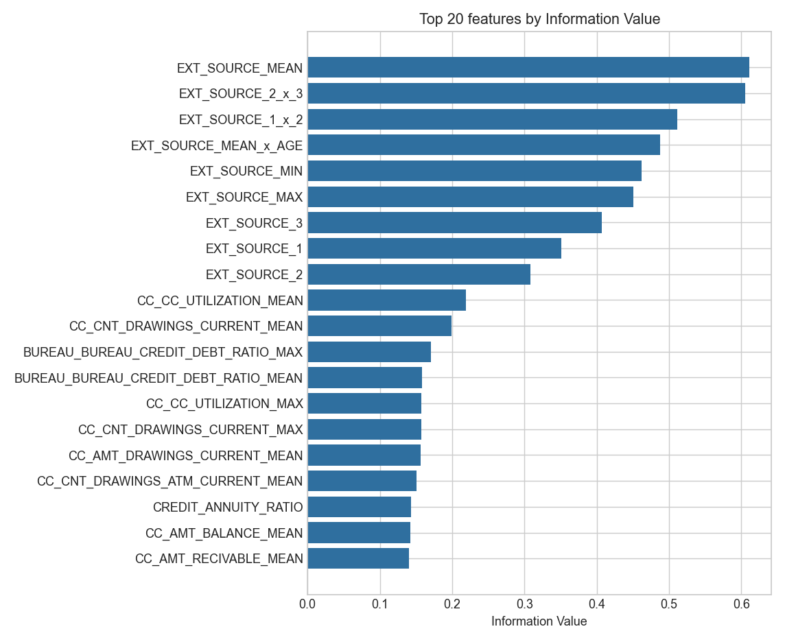
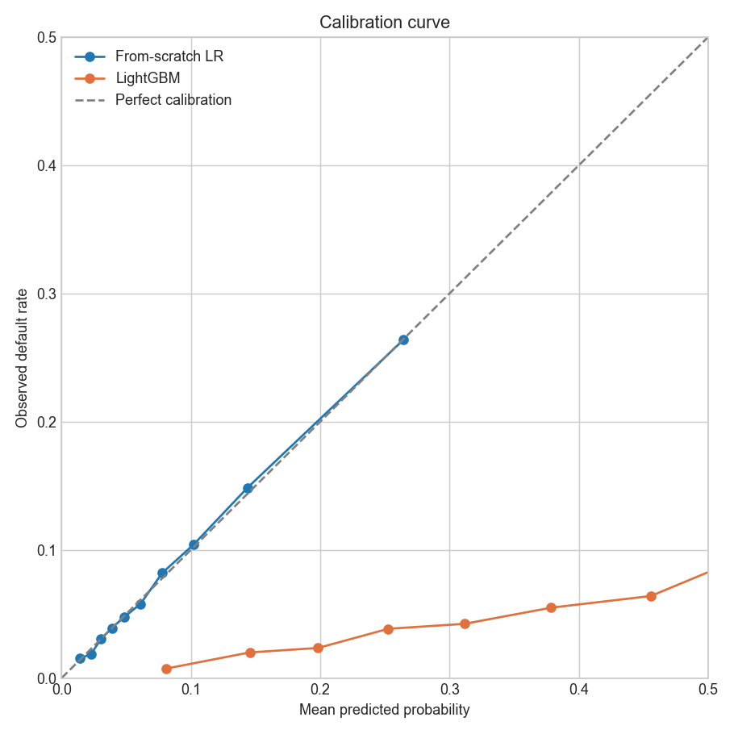
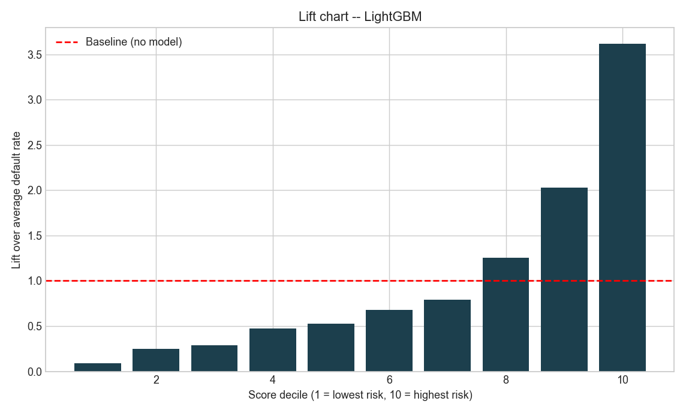
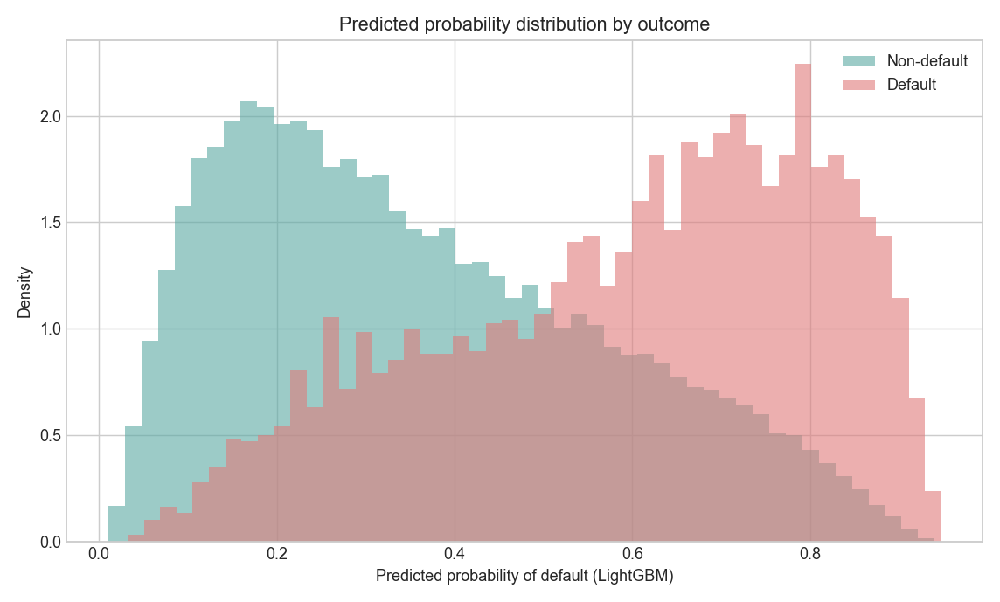

# Credit Risk Scorecard: full methodology

> The detailed write-up behind the short [README](../README.md): method, every result, tests, and known limitations. Moved here unchanged on 2026-09-29 when the README was shortened.

> From-scratch WoE/IV and logistic regression on Home Credit's 307,511 real loan applicants, checked against scikit-learn and scipy at every step, with a points-based scorecard that gives a declined applicant a specific reason.

[](LICENSE)
[](#tech-stack)
[](#tech-stack)
[](#results)
[](https://github.com/alvenyuka/Credit-Risk-Scorecard/actions/workflows/ci.yml)

A credit scorecard for Home Credit's loan applicants, built from Weight of
Evidence, a from-scratch logistic regression, and a points-based scorecard
a loan officer can read.

Start with [`Credit_Risk_Scorecard.ipynb`](../Credit_Risk_Scorecard.ipynb). It runs
the full 307,511-applicant dataset end to end, and keeps the working notes
and dead ends in rather than tidying them out afterward.

## Why?

A credit model that declines someone often has to say why. Under the US Equal
Credit Opportunity Act that reason has to be specific, and the EU AI Act treats
credit scoring as high risk, which puts the same pressure on documentation and
explainability. A gradient-boosted model would likely score higher than what is
here and could not answer that question directly.

So this is a scorecard: Weight of Evidence bins, a logistic regression over them,
and a points table where every bin contributes a fixed number of points. A
declined applicant's biggest losses come back as "lost 18 points on employment
history" rather than a probability with no account of itself. Each bin's
direction can be read off a table before the model is trained, and the point
values move only a little when it is refitted, which matters when a regulator
expects similar applicants treated consistently over time.

The second reason is that the statistics are written out rather than imported.
Weight of Evidence, Information Value, the logistic regression solver, and
AUC, GINI, KS and PSI are all built here and then checked against scikit-learn
and scipy. One of those checks failed the first time, which is the part worth
reading.

## Project Structure

```
Credit_Risk_Scorecard.ipynb   the notebook, run end to end
build_notebook.py             generates the notebook, edit this not the .ipynb
src/
  io_raw.py                   loads the application table
  baseline_features.py        application-level features
  baseline_model.py           the naive baseline
  woe_iv.py                   Weight of Evidence / Information Value
  metrics_scratch.py          AUC, GINI, KS, PSI
  from_scratch_lr.py          logistic regression by gradient descent
  relational_features.py      bureau / previous application / payment history
  scorecard.py                the points scorecard and reason codes
  results_io.py               writes outputs/results.json; the README quotes it
  week7_run.py                primitives validated against sklearn / scipy
  week8_run.py                full feature set, model, metrics
  week8_full.py               builds the scorecard, writes results.json
tests/
  test_metrics_scratch.py     AUC/GINI/KS/PSI vs sklearn and scipy
  test_from_scratch_lr.py     the solver vs sklearn, incl. class_weight
  test_woe_iv.py              WoE/IV binning, smoothing and known binning limits
conftest.py                   puts src/ on sys.path so tests import it the way the scripts do
pytest.ini
outputs/
  results.json                every headline number, written by the code
output/                       demo_applicants.json, kept from the old pipeline for the demo page
figs/                         four charts from the old pipeline, kept for the demo page
.github/workflows/ci.yml      runs the tests on every push
```

The `src/` module names carry the week they were written in, from `week7_run.py`
through `week8_full.py`. That is the order the work happened in over two weeks of
evenings, nothing more; the numbering has no meaning beyond sequence.

## Quick Start

1. Download the 8 CSVs from Home Credit Default Risk on Kaggle (see "Dataset" below) and put them in `data/`.
2. `pip install -r requirements.txt`
3. `python build_notebook.py`, then execute the generated notebook end to end (full commands under "Running it" below). Note that step 3 overwrites the committed notebook with a fresh, output-free copy, so the stored outputs are gone until you execute it.
4. Read "Methodology" below for the narrative, or jump to Results for the headline numbers.

## Features

- **Weight of Evidence / Information Value, logistic regression, and scoring metrics (AUC, GINI, KS, PSI) built from scratch**, not imported. The metrics and the solver were checked against scikit-learn and scipy before being trusted. WoE/IV has no library equivalent to check against, so it is covered by its own test suite instead (see "Tests").
- **A points-based scorecard**: every WoE bin becomes a specific score contribution, so a declined applicant's biggest point losses are named, not just a number.
- **Application, bureau, and previous-application history** combined into a single feature set (65 candidate features, of which 11 are WoE-encoded as categorical: 10 nominal columns plus one binary flag).
- **A live case-study page** ([credit-risk-alven.vercel.app](https://credit-risk-alven.vercel.app)) showing 20 held-out applicants scored by the earlier pipeline. It reads `output/demo_applicants.json`, which predates this rebuild; this repo ships no model artefact, so nothing here scores an applicant live.

## Tech Stack

| Layer | Tools |
|---|---|
| Language | Python |
| ML | scikit-learn, scipy (for cross-checking the from-scratch implementation) |
| Core logic | From-scratch WoE/IV, logistic regression (gradient descent), AUC/GINI/KS/PSI |
| Notebook | Jupyter, nbconvert |

## Dataset

Download the 8 CSVs from [Home Credit Default Risk on Kaggle](https://www.kaggle.com/competitions/home-credit-default-risk)
and put them in `data/` (not shipped in this repo).

## Running it

```bash
pip install -r requirements.txt

# the pipeline, against the 8 tables in data/. ~7 minutes.
# writes outputs/results.json, which the Results section above quotes.
python src/week8_full.py

# the notebook
python build_notebook.py
jupyter nbconvert --to notebook --execute Credit_Risk_Scorecard.ipynb \
  --output Credit_Risk_Scorecard.ipynb --ExecutePreprocessor.timeout=900
```

## Why this version of the repo looks different

This used to be a bigger pipeline: 400 candidate features, a LightGBM
benchmark, calibration figures, a live demo site. I replaced it with this rebuild on
purpose. I wanted to see if I could get to a working scorecard again on my
own, without opening the old code, and be honest in the notebook about what
went wrong along the way instead of only showing the finished version. The
old pipeline is still in this repo's git history if you want to see it.

Two things from the old version are still here deliberately: `figs/` and
`output/demo_applicants.json`. The live demo at
[credit-risk-alven.vercel.app](https://credit-risk-alven.vercel.app) reads
both straight from this repo, so removing them would have quietly broken a
page that still works. Everything else described below is the new build.

### The four figures in `figs/`, and what they are not

These four charts are the old 400-feature pipeline's output. They are shown
here rather than under Results, because none of them depicts the model this
repo now builds. The rebuild writes no charts at all: there is no matplotlib
import and no `savefig` call anywhere in `src/` or `build_notebook.py`, so
regenerating them against the current model would mean writing that code
first. Read them as a record of the earlier build.



Old pipeline's top features by IV. The bars are interaction terms
(`EXT_SOURCE_2_x_3`, `EXT_SOURCE_MEAN_x_AGE`) and double-prefixed aggregates
that the rebuild's 65-candidate feature set does not contain.





Both compare the old from-scratch LR against the old LightGBM benchmark. The
rebuild has no tree benchmark and its calibration was never measured.



This one is mislabelled by its own filename. It is a LightGBM predicted
probability histogram on a 0 to 1 axis, not a distribution of scorecard
points. The rebuild's score distribution is described in words under Results
and is not plotted anywhere.

## Methodology

I started with just the loan application form and a naive logistic
regression, to see how far that alone would get me (0.75 AUC, a floor to
beat). Then I built Weight of Evidence, logistic regression, and the usual
credit-scoring metrics (AUC, GINI, KS, PSI) from scratch instead of
importing them, and checked every one against scikit-learn and scipy before
trusting it. One of those checks failed the first time: my KS statistic was
off under tied scores because I was checking the good/bad gap in the middle
of a tied block instead of at a threshold that exists in the data. Fixed it, and it matched
exactly.

After that I added bureau history and previous-application data, which
pushed AUC to 0.76, and built a points-based scorecard where every WoE bin
becomes a specific score contribution, so a declined applicant's biggest
point losses are things like "lost 18 points on employment history," not a
number with no explanation attached.

I also caught a mistake in my own comparison. I thought I'd found
model instability from correlated features (my from-scratch model's
predictions correlated with scikit-learn's at only 0.905), when the actual
problem was that scikit-learn was using `class_weight="balanced"` and my own
implementation wasn't. Once I fixed that, the prediction correlation rose to
0.999997. Should have checked that before assuming the disagreement meant
something.

## Results

Every metric in the left-hand column is read from
[`outputs/results.json`](../outputs/results.json), which `src/week8_full.py` writes
at the end of a run, so none of them is typed in by hand. That file also records
the commit, the package versions, whether the data was real or synthetic, and the
validation row count, so any of those figures can be checked rather than taken on
trust.

Three rows in the table below come from somewhere else, and say so here rather
than being folded into the claim above. **Candidate features (65)** and
**categorical features (11)** are the lengths of the feature lists in
`src/week8_run.py`, not metrics of the run; the next run records them in
`results.json` as well. The whole **Old pipeline** column is read from the
pre-rebuild README and `BUILD_STATUS.md` at commit `979e39c~1`, which is in this
repo's git history.

`results.json` records `git_commit: b2a0ac6`, which is behind HEAD. The commits
since it touched only the README and the tests, not `src/`, so the figures still
describe the code that is here.

| | This rebuild | Old pipeline |
|---|---:|---:|
| AUC | 0.7622 | 0.751 |
| KS | 0.3940 | 0.377 to 0.381 |
| GINI | 0.5244 | not reported |
| Prediction correlation vs scikit-learn | 0.999997 | 0.9985 |
| Max coefficient difference vs scikit-learn | 0.0031 | 0.298 |
| Features kept after selection | 56 | 80 |
| Candidate features | 65 | 400 |
| Categorical features used | 11 | 0 |

Validation set: 61,503 applicants, a holdout split rather than the Kaggle test
set, so these are not leaderboard scores.

Not a fair head-to-head. Different train/test splits, and the old pipeline
did a lot more relational feature engineering than I redid here. What I
take from it: a much smaller, independently built feature set gets
comparable results, and the categorical columns the old pipeline dropped
(occupation type, income type) turned out to carry signal.

One number the comparison leaves out on purpose, so put it back: the old
pipeline also ran a LightGBM benchmark that reached AUC 0.7774, higher than
either from-scratch model here. The 0.751 above is its from-scratch LR, which
is the like-for-like comparison. This rebuild has no tree benchmark at all.

The coefficient difference is the interesting column. On this 56-feature set the
from-scratch solver lands within 0.0031 of scikit-learn; the old pipeline's
80-feature set diverged by 0.298. That gap is not a better solver, it is less
redundancy in the feature set: the old version selected four engineered variants
of the same three `EXT_SOURCE` columns, and near-duplicate predictors make
coefficients unstable without hurting predictions. Same reason its predictions
still correlated at 0.9985.

There are no charts in this section. The four images in `figs/` are the old
pipeline's and are shown, with that said plainly, under "Why this version of
the repo looks different" above. The rebuild writes no figures.

### Information value of the selected features

The strongest single feature is `EXT_SOURCE_MEAN` at IV 0.6091, which trips this
repo's own `iv_strength()` red flag for "suspiciously strong (check for
leakage)". I checked it and kept it: `EXT_SOURCE_1/2/3` are external bureau
scores supplied with the application, they are legitimate pre-decision inputs,
and their three components sit at IV 0.15 to 0.33 individually. The mean of them
is stronger than any one, which is what an average of three noisy scores of the
same thing should be. The flag is doing its job; this is the case where the
answer is that the feature is fine.

### Is the model calibrated, and does it separate?

Calibration matters more than AUC for a scorecard. A model that ranks well but
reports the wrong probability produces the right ordering and the wrong
provision. This rebuild reports separation (AUC, KS, GINI above) and does not
measure calibration, which is a gap, not a result.

### Score distribution

Mean score 455.6 for applicants who repaid, 399.5 for those who defaulted, on a
scale running 300 to 656. The point-biserial correlation between score and
default is -0.263: higher score, lower risk, which is the direction a scorecard
has to have before anything else about it matters.

## What I'd recommend

Logistic regression on Weight of Evidence features, not a gradient-boosted
model, even though the tree model would probably score higher. A declined
applicant is often legally entitled to a specific reason, and this
scorecard gives one directly. Each WoE bin's direction can be checked in a
table before the model is even trained, instead of trusting that a tree
model learned the right pattern. And the point table only shifts a little
when retrained on new data, which matters if a regulator expects consistent
treatment of similar applicants over time.

What it does not do is listed under Known Limitations below, once each.

## Known Limitations

Everything I would fix next is here, in one place, rather than spread across
three sections saying the same thing in different words.

- **Base odds aren't calibrated to this population.** 20 good borrowers per bad one at a score of 600 is a reasonable default, not fit to this dataset's actual ~8% default rate. Calibrating it would be the first fix.
- **Validation split is random, and an out-of-time split is not possible on this data.** `application_train.csv` carries no absolute application date: every temporal field is a day offset relative to the application itself. There is no column to sort on, so a forward time split cannot be constructed here at all. It is a property of the dataset, not a to-do. Doing it properly needs a source with real application timestamps.
- **Prohibited bases are in the candidate feature set.** `CODE_GENDER` and `NAME_FAMILY_STATUS` are in the 65 candidates, `CODE_GENDER` clears the IV 0.01 gate, and it appears in the fitted scorecard's reason codes. Sex and marital status are prohibited bases under ECOA and Regulation B, so "lost 7.8 points on CODE_GENDER" is not a reason a lender could lawfully give, which cuts directly against the argument this README opens with. A production build drops them before binning. This one is a defect, not a design choice, and it is not fixed here because fixing it means refitting and restating every number above.
- **Quantile binning collapses zero-inflated columns.** `fit_continuous_bins` takes deciles and dedupes the edges, so a column where most applicants sit at zero (the delinquency and overdue aggregates) loses its entire non-zero tail to one or two bins, and a 0/1 flag collapses to a single bin with IV exactly 0. Two consequences visible in this run: `BUREAU_OVERDUE_MAX` and `BUREAU_OVERDUE_MEAN` land on the identical two-bin split and so correlate at r = 1.000 once WoE-encoded, and three delinquency features fall below the IV gate and are dropped. Supervised or zero-aware binning would keep them. `tests/test_woe_iv.py` pins the behaviour so a fix cannot land silently.
- **PD only, not a full IFRS 9 loss estimate.** This scorecard outputs a probability of default; loss given default and exposure at default are separate models not built here.
- **The rebuild-vs-old-pipeline comparison in Results isn't a controlled benchmark**: different train/test splits, not an apples-to-apples A/B.

## Tests

```bash
python -m pytest        # about 8 seconds
```

The from-scratch implementations are the whole point of this repo, so they are
tested rather than asserted. Every test runs on small synthetic data with a fixed
seed. Where a library computes the same quantity, the test checks the
hand-written version against it: `auc_rank_sum` against
`sklearn.metrics.roc_auc_score`, `gini` against `2 * roc_auc_score - 1`,
`ks_statistic` against `scipy.stats.ks_2samp`, and the gradient-descent logistic
regression against `sklearn.linear_model.LogisticRegression`.

WoE and IV have no library equivalent to compare against, so `test_woe_iv.py`
checks their properties instead: a near-perfect separator scores a high IV, pure
noise scores near zero, the smoothing keeps an empty bin finite, an unseen
category on a new split maps to a neutral 0, and the zero-inflation collapse
described under Known Limitations is pinned so a change to the binner cannot
land unnoticed.

Two tests exist because of bugs this rebuild hit:

- **`test_ks_handles_heavy_ties`.** Computing the cumulative gap row by row after
  a plain sort evaluates it partway through a block of tied scores, at points
  that do not exist in the empirical CDF, which produces a spurious maximum. The
  bug is invisible on continuous scores and appears the moment scores are
  bucketed, which is exactly what a scorecard does.
- **`test_balanced_matches_sklearn_balanced`.** An earlier version of the
  comparison harness compared a weighted fit against an unweighted sklearn fit,
  which is comparing two different objectives rather than two solvers of the same
  problem.

Because the tests use synthetic data, CI can run them without the 2.5 GB dataset.
The full pipeline run against the real data stays a local step.

## Roadmap

- [x] From-scratch WoE/IV, logistic regression, and scoring metrics, verified against scikit-learn/scipy
- [x] Bureau and previous-application relational features
- [x] Points-based scorecard with reason codes
- [ ] Calibrate base odds to this dataset's actual ~8% default rate
- [ ] Drop ECOA-prohibited bases from the candidate set and refit
- [ ] Zero-aware or supervised binning for the delinquency columns
- [ ] LGD/EAD models for a full IFRS 9 loss estimate
- Out-of-time validation split: not possible on this dataset, see Known Limitations

## License

MIT. See [`LICENSE`](../LICENSE).

## Credits

Author: **Alven Yuka**, CPA Finalist. Built on the [Home Credit Default Risk](https://www.kaggle.com/competitions/home-credit-default-risk) dataset (Kaggle).

